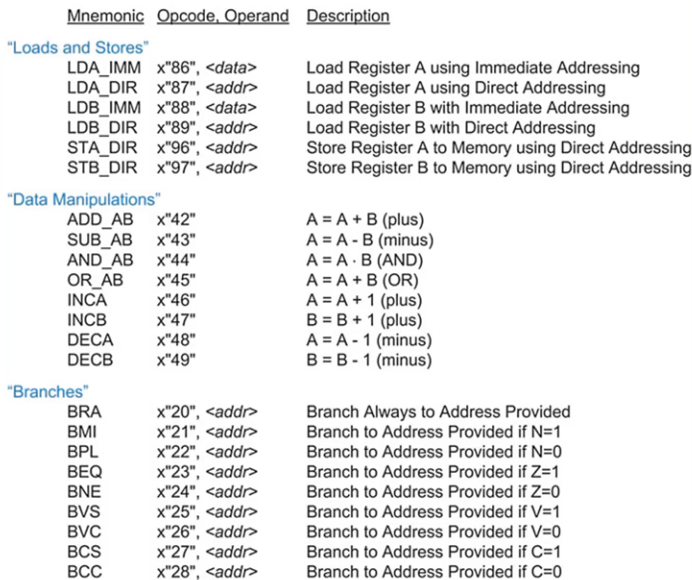

I have designed an 8-bit processor using VHDL, which supports a range of instructions for load/store operations, data manipulation, and branching. The processor is capable of performing arithmetic and logical operations between two 8-bit registers, A and B, with immediate and direct addressing modes for loading and storing data. It also includes instructions for conditional and unconditional branching based on flags like zero (Z), carry (C), negative (N), and overflow (V).

Key Features:

Load and Store Operations: Supports both immediate and direct addressing modes for loading data into registers A and B. Arithmetic and Logical Operations: Includes addition, subtraction, bitwise AND, and OR operations between registers. Increment/Decrement Operations: Can increment or decrement register values by 1. Branching Mechanisms: Branching is supported based on various flag conditions, allowing for conditional control flow.

